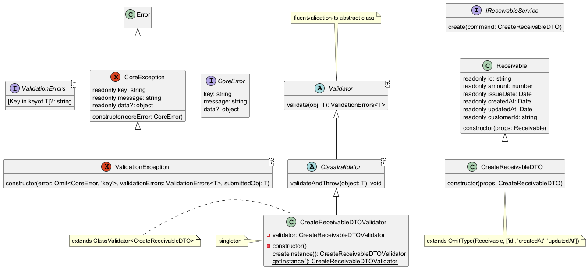

# Class Validator TypeScript

This project showcases an approach to validating classes upon instantiation using TypeScript and [fluentvalidation-ts](https://www.npmjs.com/package/fluentvalidation-ts).

## Tech Stack


## Validation Strategy

### UML Diagram



### Guidance

- Payload schema validation is performed in the Core (business) layer by creating a validator class that extends `ClassValidator<T>`. The class validator is executed inside the DTO constructor.
  - DTOs are instantiated in the Controller layer and then passed to the Core layer through a Service interface.
- If validation fails, a `ValidationException` is thrown.
- The [fluentvalidation-ts](https://www.npmjs.com/package/fluentvalidation-ts) library is used to implement class validation functionalities. It is based on .NET's [Fluent Validation](https://docs.fluentvalidation.net/en/latest/index.html).
- This sample demonstrates the instantiation of a DTO designed for use by `ReceivableService` when creating new receivables.

## Installation

```bash
$ pnpm install
```

## Test

```bash
# unit tests
$ pnpm run test

# test coverage
$ pnpm run test:cov
```

## Quick Note

[NestJS](https://nestjs.com/) was chosen for this project because it provides a scalable and modular architecture, making it a good foundation for future use cases beyond class validation. This project may evolve to demonstrate additional scenarios that leverage NestJS's built-in features, such as dependency injection, interceptors, and middleware.
